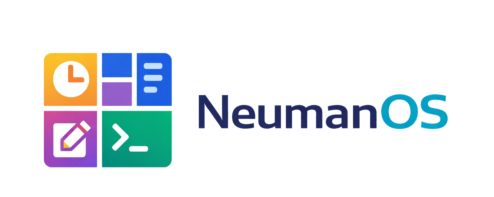
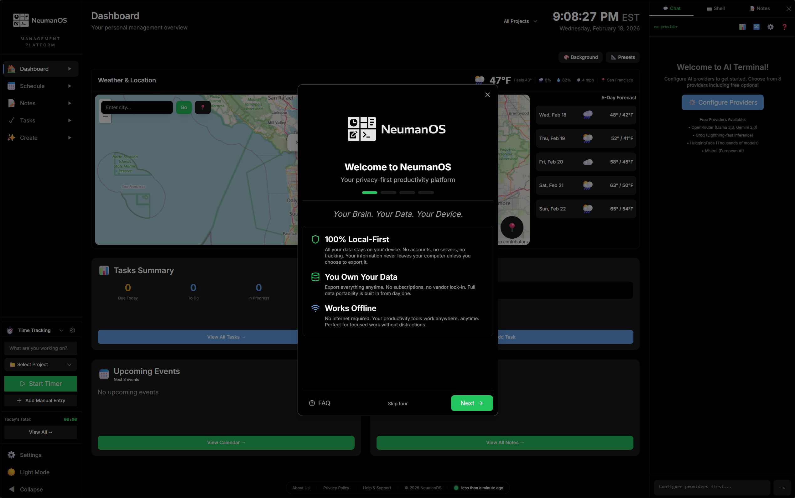
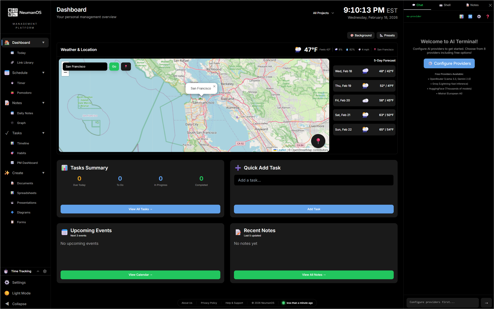

### Your Brain. Your Data. Your Device.

**A privacy-first, local-only platform for organizing your life and work without surrendering your data.**

**[Live Demo](https://os.neuman.dev)** &nbsp;|&nbsp; **[Documentation](https://os.neuman.dev)** &nbsp;|&nbsp; **[Report Bug](https://github.com/travisjneuman/neumanos/issues)** &nbsp;|&nbsp; **[Request Feature](https://github.com/travisjneuman/neumanos/discussions)**

---

 &nbsp; 

---

## What is NeumanOS?

NeumanOS is an all-in-one productivity platform that lives entirely on your device. Notes, tasks, time tracking, calendar, bookmarks, and an AI terminal — unified in a single app, with no account required and no data leaving your machine.

Most productivity tools scatter your work across a stack of subscriptions you don't fully control. NeumanOS puts everything back in one place, under your ownership. Every note, task, and calendar event is stored in your browser's local storage — readable only by you, exportable at any time, and never touched by a server.

It's free, open source, and built on the principle that software that organizes your life should respect it.

---

## Features

### Notes & Knowledge Management

Rich text editing, full markdown support, and wiki-style `[[links]]` between notes. A D3 force-directed graph view reveals the connections in your knowledge base. Daily notes, nested tags, slash commands, and full-text search keep your writing fast and your ideas linked.

### Task & Project Management

Kanban boards with drag-and-drop columns, task dependencies, subtasks, priority levels, and a timeline view for scheduling work across time. A daily habit tracker with streaks sits alongside your projects, so routines and goals live in the same place.

### Time Tracking

A persistent sidebar timer stays with you across the app. Log hours by project, review daily and weekly summaries, generate monthly reports with heat maps, and export to CSV for invoicing. Manual entry and bulk operations handle the moments when life doesn't run on a stopwatch.

### Calendar & Scheduling

Month, week, day, and agenda views with drag-and-drop rescheduling. Recurring events, browser reminders, conflict detection, and two-way ICS import/export for compatibility with Google Calendar and Apple Calendar. Task due dates appear directly on the calendar.

### Dashboard & Widgets

A fully customizable home screen with 44+ widgets spanning productivity, information, utilities, and finance. Weather, world clocks, calculators, countdown timers, stock tickers, news feeds, Pomodoro timer, and live summaries of your notes, tasks, and events — arranged exactly how you want them.

### AI Terminal

Connect to 8+ AI providers — OpenAI, Anthropic Claude, Google Gemini, Groq, Mistral, xAI Grok, DeepSeek, and more — using your own API keys. Keys are stored with AES-256-GCM encryption and never leave your device. A built-in browser terminal with AI command integration rounds out the developer experience.

### Office Suite

Create documents, spreadsheets, presentations, diagrams, and forms without leaving the platform. The spreadsheet engine supports 400+ Excel-compatible formulas. Presentations include a full canvas editor, 8 slide templates, animations, and presenter mode. Export to PDF, HTML, Markdown, CSV, or PPTX.

### Link Library

A bookmark manager with nested folders, drag-and-drop import from browser bookmark HTML files, duplicate detection, and full-text search. Favicons are cached locally. Export back to standard browser format at any time.

---

## Your Privacy, Protected

- **100% local storage.** Every note, task, event, and setting is stored in your browser's IndexedDB — up to 50GB, on your device, under your control.
- **No account required.** Open the app and start working. Nothing to sign up for, nothing to verify.
- **No cloud dependencies.** No Firebase, no AWS, no third-party database — the app is a static site with nothing to phone home to.
- **Encrypted API keys.** AI provider keys are stored with AES-256-GCM encryption and a session-based password. They are never logged or transmitted.
- **Open source.** The code is MIT-licensed and publicly auditable. If you don't trust the hosted version, you can run it yourself.
- **Anonymous analytics only.** The hosted site uses Cloudflare Web Analytics — no cookies, no fingerprinting, GDPR compliant. Your data is never part of it.

---

## Get Started

No installation required. Visit the live app at:

**[https://os.neuman.dev](https://os.neuman.dev)**

NeumanOS is a Progressive Web App. On supported browsers, you can install it to your home screen or desktop for a native-like experience with offline access. Look for the install prompt in your browser's address bar.

In-app documentation is available directly inside NeumanOS. Open the app and navigate to the Docs section for guides on every feature.

---

## Contributing

NeumanOS is open source and contributions are welcome. Whether you're fixing a bug, improving documentation, or proposing a new feature, the process starts with a GitHub Issue or Discussion so we can align before code is written.

See **[CONTRIBUTING.md](CONTRIBUTING.md)** for the full contributor guide, code standards, and pull request process.

---

[os.neuman.dev](https://os.neuman.dev) &nbsp;|&nbsp; [GitHub](https://github.com/travisjneuman/neumanos) &nbsp;|&nbsp; [Issues](https://github.com/travisjneuman/neumanos/issues) &nbsp;|&nbsp; [os@neuman.dev](mailto:os@neuman.dev)

**Made with care for privacy, productivity, and open source.**

